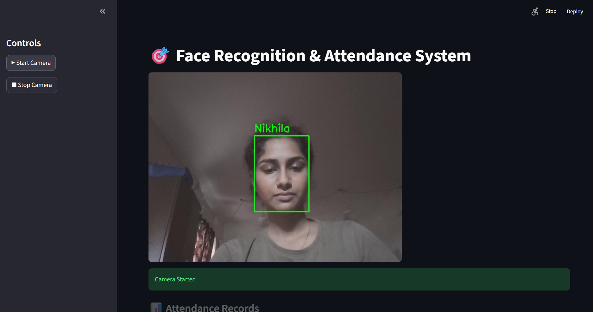

# 🎯 Face Recognition & Attendance System

## 📌 Overview
This project is a real-time face recognition and attendance system built using OpenCV and Machine Learning.  
It detects faces from a live webcam feed, recognizes individuals, and logs attendance automatically.

---

## 🚀 Features
- 🎥 Real-time face detection using OpenCV DNN  
- 🧠 Face recognition using KNN classifier  
- ❌ Unknown face detection  
- 📊 Automatic attendance logging (CSV file)  
- 🖥️ Interactive UI using Streamlit  
- 📥 Download attendance records  

---

## 🧠 How It Works
1. Capture live video using webcam  
2. Detect faces using deep learning-based OpenCV DNN model  
3. Preprocess face (grayscale + resize)  
4. Convert image into feature vector  
5. Use KNN to classify face  
6. If match found → display name  
7. If no match → mark as "Unknown"  
8. Store attendance with timestamp  

---

## 🛠️ Technologies Used
- Python  
- OpenCV  
- Scikit-learn (KNN)  
- NumPy  
- Streamlit  

---

## 📂 Project Structure
ml/
│── dataset/
│── train_model.py
│── recognize.py
│── face_ui_pro.py
│── model.pkl
│── attendance.csv
│── deploy.prototxt
│── res10_300x300_ssd_iter_140000.caffemodel

---

## ▶️ How to Run

### Step 1: Install dependencies

### Step 2: Train model

### Step 3: Run UI

---

## 📊 Sample Output
- Live face detection with bounding box  
- Recognized name displayed  
- Unknown faces marked  
- Attendance saved in CSV  

---

## ⚠️ Limitations
- Sensitive to lighting conditions  
- Performance depends on dataset quality  
- Uses pixel-based features (can be improved using deep learning embeddings)

---

## 🔮 Future Improvements
- Use FaceNet / deep learning embeddings  
- Add login authentication  
- Deploy as web application  
- Improve accuracy with larger dataset  

---

## 👩‍💻 Author
**Nikhila**

---

